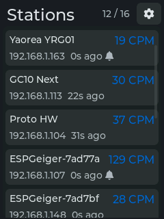
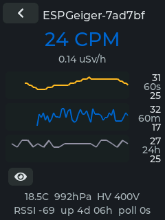

# ESPGeiger Gadget

A LAN companion display for [ESPGeiger](https://github.com/steadramon/ESPGeiger) radiation detectors. Auto-discovers stations on the network via mDNS, subscribes to their live UDP click streams, and renders per-station CPM, sparklines, µSv/h, and 24-hour history on a 2.8" touch screen. Runs on a Sunton ESP32-2432S028R "Cheap Yellow Display".

<p align="center">
  
  &nbsp;&nbsp;
  
</p>

## Hardware

Sunton ESP32-2432S028R — 240×320 SPI panel, resistive touch, speaker, USB-C. ~£8 / US$10 [from AliExpress](https://s.click.aliexpress.com/e/_c3zLYcL3) (with or without case).

Both ILI9341 (Rv2) and ST7789 (Rv3) panel revisions are supported; flash whichever PlatformIO env matches the board.

## Build and flash

```sh
pio run -e cyd                  # ST7789 (Rv3), release
pio run -e cyd_ili9341          # ILI9341 (Rv2)
pio run -e cyd_debug            # with serial logging
pio run -e cyd -t upload        # flash via USB
pio run -e cyd -t monitor       # serial monitor (115200)
```

First boot shows a WiFi picker; pick an SSID, enter the password on the on-screen keyboard, and the gadget reconnects automatically thereafter. Everything else (theme, hostname, audio, watchdogs, station cap) lives under the gear icon and persists to NVS.

Future firmware updates can be uploaded over the network at `http://<hostname>.local/update` — the dual-partition layout (1.9 MB OTA slots) automatically rolls back if the new firmware crashes within 30 s of boot.

## Acknowledgements

- [steadramon/ESPGeiger](https://github.com/steadramon/ESPGeiger) — the parent firmware this gadget orbits.
- [rzeldent/esp32-smartdisplay](https://github.com/rzeldent/esp32-smartdisplay) and the [Sunton board JSONs](https://github.com/rzeldent/platformio-espressif32-sunton).
- [LVGL](https://lvgl.io/) and [LovyanGFX](https://github.com/lovyan03/LovyanGFX).

## License

GPLv3, matching the parent ESPGeiger firmware.
